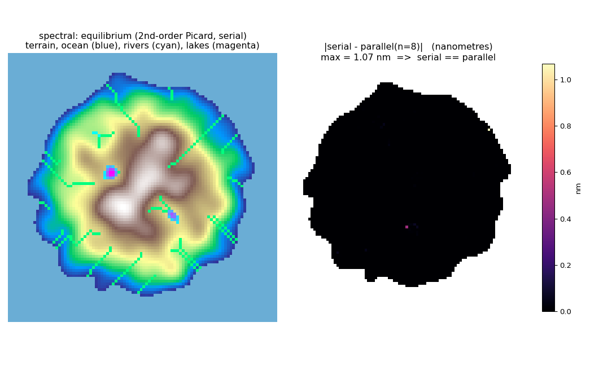
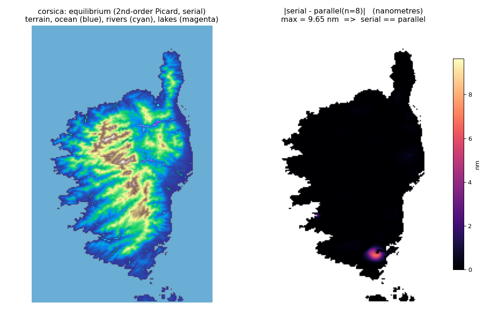

# Island equilibrium — implicit groundwater, serial ≡ parallel

WTM run to **equilibrium on an island** (ocean along every side) with the **2nd-order-in-time
implicit solver** (`-wtm_bdf2_on_V`, the semi-implicit Picard / BDF2-on-V path), in **serial and on
N MPI ranks**. It demonstrates two things at once:

- **serial ≡ parallel** — the equilibrium water table is identical whether the run is on 1 rank or
  on 4/8 MPI ranks, to floating-point-reduction noise (~1e-8 m); and
- the full **surface hydrology** — **lakes** ponded in closed depressions, **rivers** draining to
  the coast, and the **ocean** boundary — produced by the FillSpillMerge coupling.

## Run

```sh
# build first (produces build/wtm.x), then:
python3 examples/island_equilibrium/demo.py spectral --map
python3 examples/island_equilibrium/demo.py corsica  --map
```

Requires `rasterio` and `numpy` (and `matplotlib` for `--map`). Each run does serial (`n=1`) plus
`--ranks` (default 4 and 8), reports the cross-rank max difference, and — with `--map` — renders the
figure described next.

## Reading the figures

Each figure below has **two panels**:

- **Left — the equilibrium surface hydrology (serial run).** Terrain shaded by elevation; the
  **ocean** boundary in blue; the **river** network (drainage) in cyan; and **lakes** (standing water
  ponded in closed depressions) in magenta.
- **Right — serial vs. parallel, in nanometres.** The absolute difference between the serial (`n=1`)
  and parallel (`n=8`) equilibrium water tables, `|wtd_serial − wtd_parallel|`, scaled to nm. It is
  essentially **all black (0 nm)** — a max of a few nanometres, at the level of floating-point
  reduction noise — so the two runs are the **same answer**. That is the point of the demo: the
  implicit 2nd-order solve is identical whether run on one core or on eight MPI ranks.

## Two topographies

### `spectral` — a synthetic island

A radial dome (island shape → coastline) plus a few Fourier modes (realistic relief → valleys/rivers)
plus two carved basins (guaranteed lakes). Deterministic and fully self-contained.



### `corsica` — a real DEM

A 240×156 window of the **GEBCO_08** global DEM over **Corsica** (lon 8.4–9.7°E, lat 41.2–43.2°N;
Monte Cinto at 2453 m). Bundled here as `corsica_gebco.tif`, so **no GEBCO download is needed** to run
the example. Real closed basins fill to lakes; the drainage network runs off the mountains to the sea.



## Results

| topography | grid | converges (n=1/4/8) | lakes | **serial vs n=8** |
|---|---|---|---|---|
| `spectral` | 96² | 60/60 solves | 37 cells | **max 5.2e-9 m** |
| `corsica`  | 240×156 | 45/45 solves | 183 cells, to 79 m | **max 9.6e-9 m** |

Both are machine-zero cross-rank — the implicit 2nd-order equilibrium is bit-consistent across rank
counts.

## Notes

- **Solver.** The 2nd-order Picard path (`-wtm_bdf2_on_V`) converges on the steep Corsica DEM, where
  the default matrix-free **Anderson solver does not** (it stalls at the iteration cap — a
  conditioning issue that the Picard SPD operator + CG/GAMG handles; the surface-transition tapers do
  not change it). This is a concrete argument for the implicit Picard solver on real steep terrain.
- **Timestep.** On this setup, BDF2-on-V converges robustly across step sizes (the per-step iteration
  count *drops* as `deltat` shrinks); the observed temporal order trends toward 2 once the
  first-step backward-Euler startup is amortized (cleanest on the controlled synthetic order tests in
  `benchmark/picard/`).

`corsica_gebco.tif` is derived from GEBCO_08 (GEBCO Compilation Group); see https://www.gebco.net for
terms.
